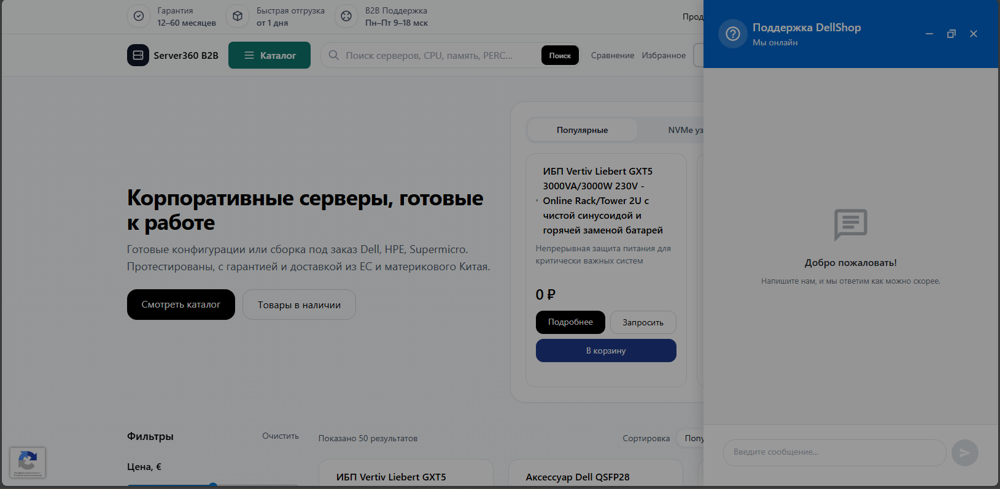

# TD-039: Drawer режим — мутный экран и случайное сворачивание

**Статус:** TODO
**Приоритет:** Средний
**Компонент:** chat-widget

## Проблема

При открытии виджета на полный экран (режим drawer):
1. Экран за виджетом становится мутным (backdrop blur?)
2. При клике в любой угол чат сворачивается в кнопку

Скриншот: `screens/Screenshot_3.png`

## Ожидаемое поведение

- Drawer должен занимать только правую часть экрана
- Клик вне области drawer не должен сворачивать виджет (или только по явному клику на backdrop)
- Фон не должен быть чрезмерно размытым

## Задачи

- [ ] Расследовать причину backdrop blur
- [ ] Проверить обработчики кликов на backdrop
- [ ] Исправить поведение сворачивания
- [ ] Протестировать в разных разрешениях

## Файлы для исследования

- `chat-widget/src/ui/container.ts` — контейнер виджета
- `chat-widget/src/styles/` — CSS стили
- `chat-widget/src/widget.ts` — логика переключения режимов
