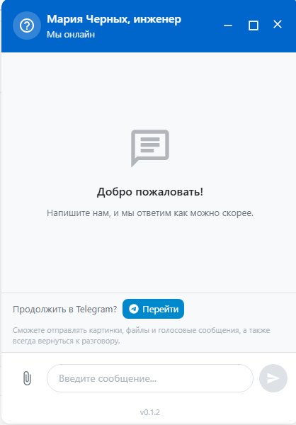

# TD-040: Аватар и имя бота в шапке виджета

**Статус:** TODO
**Приоритет:** Низкий
**Компонент:** chat-widget, backend

## Идея

Вместо статичной иконки и заголовка "Поддержка DellShop" показывать:
- Аватар используемого Telegram бота
- Имя бота как заголовок

Скриншот текущего состояния: `screens/Screenshot_4.png`



## Требования

1. **Аватар бота:**
   - Получать аватар через Telegram Bot API (`getMe` + `getUserProfilePhotos`)
   - Сохранять на сервере (кэширование)
   - Заглушка если аватар не задан — **нужна картинка от пользователя**

2. **Имя бота:**
   - Получать через `getMe` при старте бота
   - Передавать в виджет через конфиг или API

## Технические задачи

- [ ] Backend: эндпоинт для получения инфо о боте (имя, аватар URL)
- [ ] Backend: кэширование аватара бота локально
- [ ] Backend: заглушка для бота без аватара
- [ ] Widget: получение данных бота при инициализации
- [ ] Widget: отображение аватара в Header
- [ ] Widget: отображение имени бота вместо хардкода

## API

```typescript
// GET /api/chat/bot-info
{
  name: string        // "DellShop Support Bot"
  username: string    // "@dellshop_support_bot"
  avatarUrl: string   // "/api/chat/bot-avatar" или URL заглушки
}
```

## Файлы для изменения

- `src/bot/index.ts` — получение инфо о боте
- `src/http/routes/chat.ts` — новый эндпоинт
- `chat-widget/src/ui/header.ts` — отображение аватара и имени
- `chat-widget/src/types/` — типы для bot info

## Заметки

Заглушка для аватара — ожидает картинку от пользователя.
